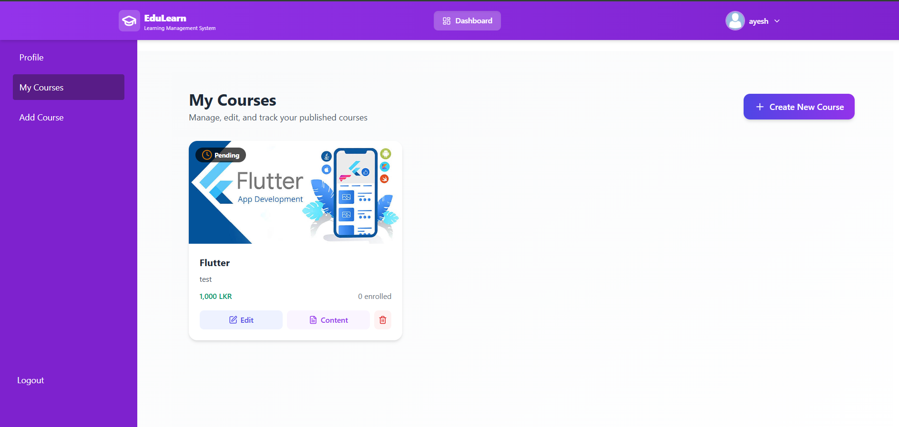
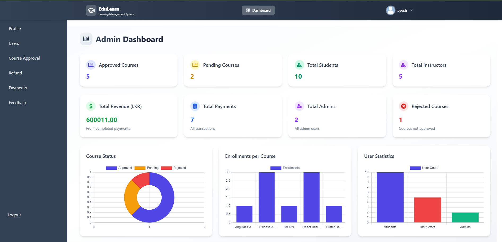
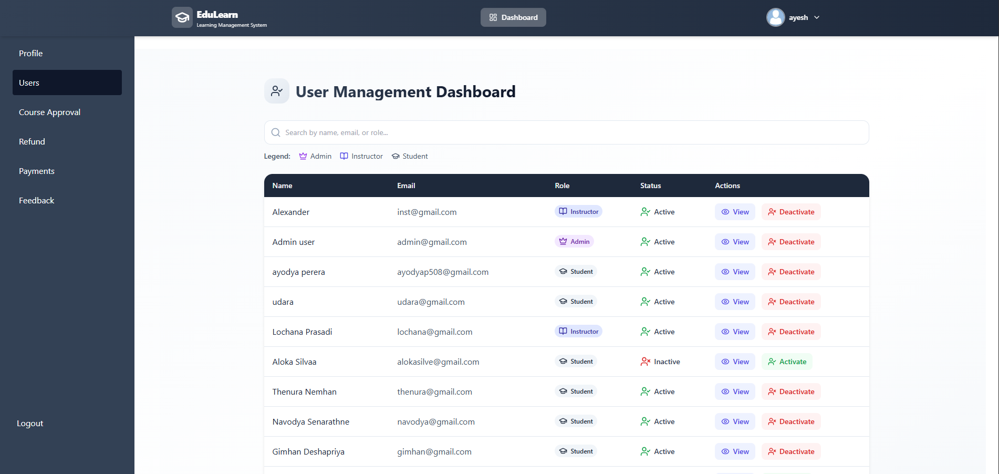
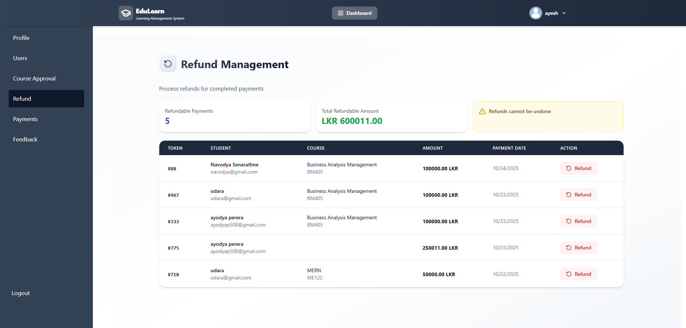
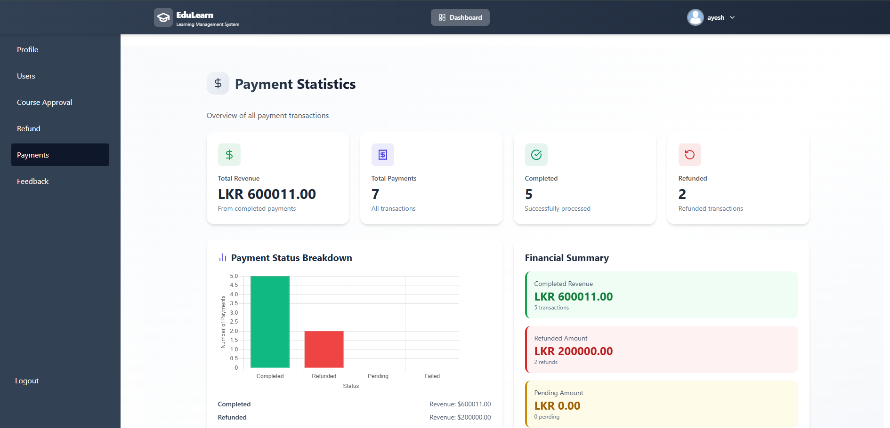

# EduLearn · Frontend

A React learning management application for discovering courses, managing learning content, and administering users and payments. EduLearn provides separate workspaces for students, instructors, and administrators.

**[Backend repository](https://github.com/ChaminduWn/Learning_Management_System-Backend)** · **[Screenshots](#screenshots)** · **[Getting started](#getting-started)**


## Features

| Workspace | Capabilities |
| --- | --- |
| Student | Search and filter courses, enroll in free courses, pay for paid courses, complete modules, track progress, print completion certificates, and view payment history and receipts. |
| Instructor | Create courses, edit details, manage video/image/PDF/link content, and track course approval and enrollment. |
| Admin | View dashboard statistics, search users, activate or deactivate accounts, approve or reject courses, manage refunds, review payments, and respond to feedback. |
| Shared | Registration, login, password recovery, profile editing, and role-specific navigation. |

## Technology

| Area | Tools |
| --- | --- |
| Interface | React 19, React Router 7 |
| Styling and animation | Tailwind CSS 3, Framer Motion |
| Charts | Chart.js, react-chartjs-2 |
| Payments | Stripe.js, React Stripe.js |
| Icons and notifications | Lucide React, React Icons, React Toastify |
| Development | Create React App / react-scripts 5, React Testing Library |

## Getting started

### 1. Install dependencies

You need Node.js, npm, Git, and the companion backend. No Node.js version is pinned in this repository.

```bash
git clone https://github.com/ChaminduWn/Learning_Management_System-Frontend.git
cd Learning_Management_System-Frontend
npm ci
```

### 2. Configure payments

Create `.env.local` in the repository root:

```dotenv
REACT_APP_STRIPE_PUBLISHABLE_KEY=pk_test_replace_with_your_publishable_key
```

Use a Stripe test publishable key from the same account as the backend's test secret key. Only the publishable key belongs in the frontend; React environment variables are included in the browser bundle. Restart the development server after changing this file.

### 3. Start the application

Follow the [backend setup guide](https://github.com/ChaminduWn/Learning_Management_System-Backend#readme) and run its API on `http://localhost:5000`. Then, in this repository:

```bash
npm start
```

Open **http://localhost:3000**. Requests currently use `http://localhost:5000/api` directly in the source, and the backend permits the frontend origin `http://localhost:3000`.

### 4. Explore the workflow

1. Register an **Instructor** account and create a course with learning modules.
2. Sign in as an **Admin** and approve the course. See the backend guide for initial admin setup.
3. Register a **Student** account and browse approved courses.
4. Enroll in a free course or use Stripe test mode for a paid course.
5. Complete its modules and open the completion certificate for printing.

The registration form offers Student and Instructor roles. An empty database will not contain the courses, users, or transactions shown in the screenshots.

## Screenshots

### Course discovery

Searchable course cards with free enrollment and paid checkout entry points.


### Instructor course management

Course approval status, enrollment counts, and shortcuts to edit details and content.



### Administration overview

Summary cards and charts for course approvals, enrollments, users, and payments.



<details>
<summary><strong>User management</strong></summary>

Search accounts by name, email, or role and manage activation status.



</details>

<details>
<summary><strong>Refund management</strong></summary>

Review completed payments and initiate refunds.



</details>

<details>
<summary><strong>Payment statistics</strong></summary>

Review revenue totals and the distribution of payment statuses.



</details>

## Project structure

```text
docs/screenshots/    README screenshots
public/             Static public assets and HTML entry point
src/
  components/       Shared UI, route guards, and administration components
  context/          Authentication state
  pages/
    admin/          Administrator dashboard
    courses/        Instructor course and content management
    instructor/     Instructor dashboard
    student/        Catalog, learning progress, and certificates
  App.js            Routes and Stripe initialization
```

## Available commands

| Command | Purpose |
| --- | --- |
| `npm start` | Run the development server. |
| `npm run build` | Generate the production bundle in `build/`. |
| `npm test` | Open the interactive test runner. |

## Troubleshooting

| Symptom | Check |
| --- | --- |
| Courses or login requests fail | Start the backend on port 5000 and confirm its MongoDB connection succeeds. |
| Browser reports a CORS error | Use port 3000, or update the allowed origin in the backend's `server.js`. |
| Stripe key is undefined | Set `REACT_APP_STRIPE_PUBLISHABLE_KEY` in `.env.local` and restart `npm start`. |
| A changed role does not appear | Log out and back in to refresh locally stored account information. |
| A new course is absent from the catalog | An administrator must approve it first. |

## Deployment notes

- Replace hardcoded localhost API URLs before deploying to another host; there is currently no centralized API URL environment setting.
- Configure the backend's allowed origin and `CLIENT_URL` for the deployed frontend.
- Configure the static host to serve `index.html` for client-side routes, then publish the output of `npm run build`.
- The interface displays LKR in several places, while the backend currently creates Stripe PaymentIntents in USD. Align currency throughout the application before using live payments.

## Contributing

For bug reports, include the affected role, page, reproduction steps, and relevant browser errors without credentials or tokens. Keep pull requests focused and describe how you verified the affected workflow.
